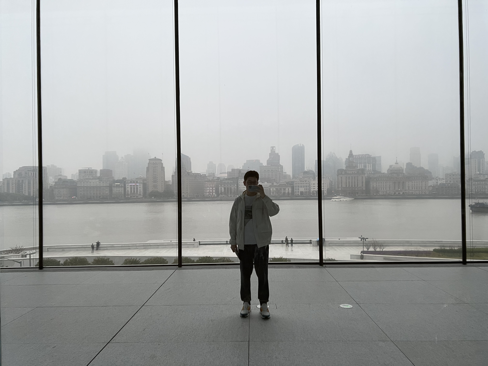
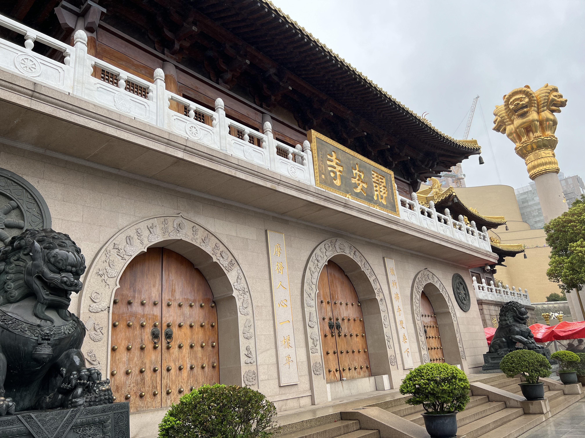
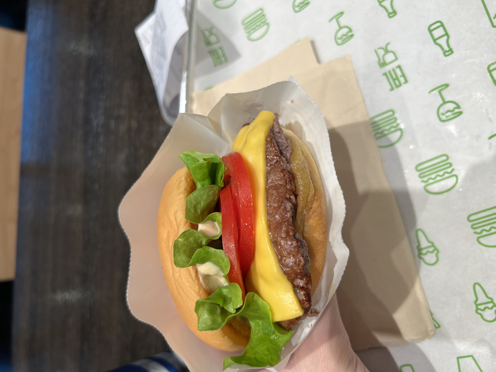

这次属于是第一次试中联航盲盒，空客 330，是个三排大飞机，等全部旅客登机就等了很久。

简单 3 的天旅程，带了个包就走了。

虹桥机场二号线直达陆家嘴。

### 陆家嘴

东方明珠开幕雷击

高楼林立，还是很震撼的，和北京完全不一样的感受。

### 南京路｜外滩

先吃了个蟹粉捞面，不错

仙气环绕

第二天起来发现 SFU 发来的 offer，也算是这次旅行让人高兴的一部分，1st offer，终于有书读了。

天气还是仙气飘飘，能见度比较低。

早饭吃个浇头面

### 陆家嘴

经典汤臣一品

体验了一下两元轮渡

### 豫园｜城隍庙

今天一直下着小雨

豫园像迷宫一样，大户人家

### 新天地

路边的花很好看

一大纪念馆看了一下，弄的很不错

送外卖也要坐船我没有想到

### 陆家嘴

陆家嘴沿江道，城建景观做的很好，在这里跑步一定非常舒适

### 浦东美术馆

简单吃了点小杨生煎真的很好吃啊

### 前滩太古里

### 思南公馆

### 徐家汇

### 静安寺

上海人貌似很喜欢 shakeshack，到处都是

然后就返程了！晚上赶着末班车回西土城。
