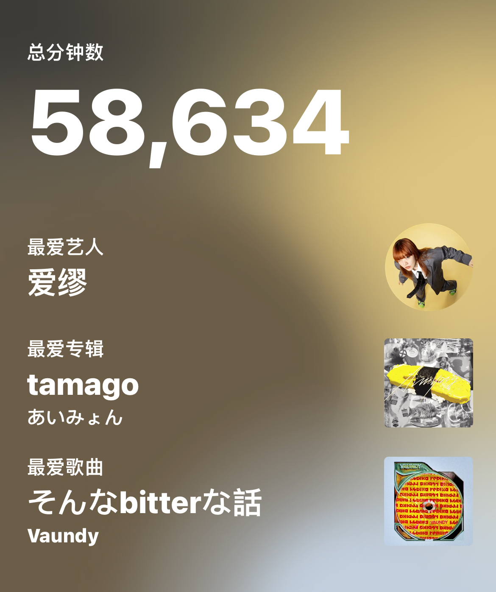
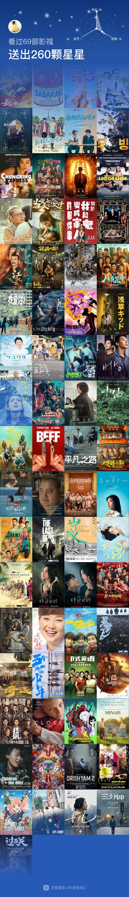

缝合一下今年的年度报告，留个纪念。

### Apple Music Replay

今年的报告呼应了开年时候红白歌会给我留下深刻印象的两个年轻人，Aimyon和Vaundy，没想到一听就是一年。恰好Apple Music推出了每月的数据，看了一下，开年大部分时间在听Aimyon，Vaundy和YOASOBI。7-8月份也算是去香港游玩的原因，听了两个月张国荣，最爱的春夏秋冬。而9-10月在海口那段时间一直在听五月天，每天晚上去跑步都在听一半人生。每一段记忆都绑定了特定的一些歌手。 今年留下印象最深的一首单曲应该是Aimyon的幸せになりたい，去秦皇岛旅游时一直在循环，至于到现在听到这首歌都能想起北戴河微凉的海风和空气的味道。最推荐的歌手是Vaundy，他这一年创作也很积极，几乎发的每一首新歌都很抓耳，作为同龄人很是佩服，尤其是そんなbitterな話，每次听到都觉得心情豁然开朗。

#### 歌手 Top12

#### 单曲 Top12

#### 专辑 Top12

## 豆瓣

先点名表扬一下年度印象最深刻的作品（纯属开玩笑，基于个人偏好）

SOTO年度新电影奖🥇**奥本海默**

SOTO年度老电影奖🥇**山河故人**

SOTO年度新剧集奖🥇**重启人生**

SOTO年度动画奖🥇**进击的巨人最终季完结篇后篇**

SOTO年度导演🥇**贾樟柯**

SOTO年度音乐人🥇**Vaundy**

### 微信读书

今年仅有的读书时间好像都是在飞机上，

读的最好的一本书是 **《一句顶一万句》**

### Apple Watch

### 航旅纵横

</ div>