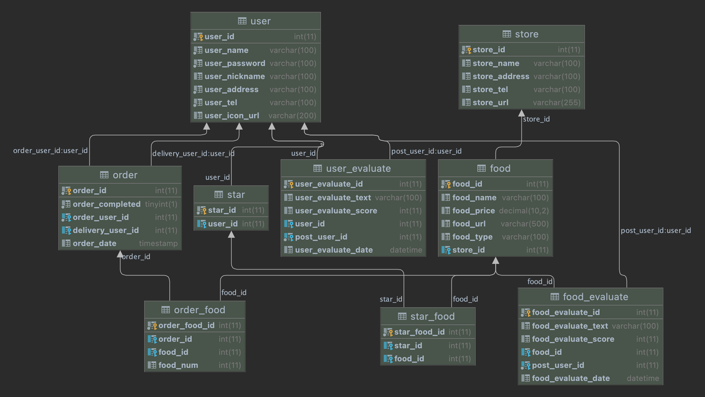
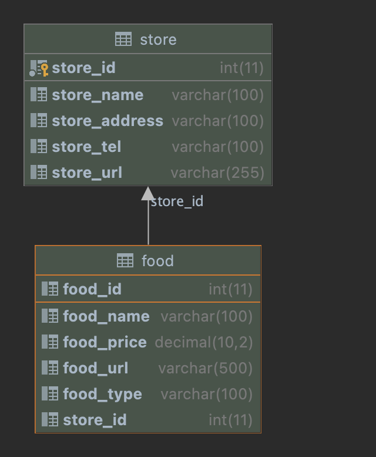

## 开发环境

- Python
- Django
- PyTorch
- MySQL

## 云端部署

我们将后端 Django 和数据库均部署在服务器上，并且进行了域名解析，可以通过 delivery.mcatk.com 直接访问后端，前端可以在任意情况下发送请求。

服务器供应：腾讯云&阿里云
服务器系统：CentOS 7
数据库：MySQL 5
解释器：Anaconda 3

## 数据库结构



## 后端实现接口

```python
path('api/login/', myapp.views.login),
path('api/register/', myapp.views.register),
path('api/getInformation/', myapp.views.get_information),
path('api/changeInformation/', myapp.views.change_information),
path('api/changePassword/', myapp.views.change_password),
path('api/getStores/', myapp.views.get_stores),
path('api/getStoreInformation/', myapp.views.get_store_information),
path('api/deleteUser/', myapp.views.delete_user),
path('api/getEvaluateFood/', myapp.views.get_evaluate_food),
path('api/evaluateFood/', myapp.views.evaluate_food),
path('api/deleteEvaluateFood/', myapp.views.delete_evaluate_food),
path('api/getEvaluateUser/', myapp.views.get_evaluate_user),
path('api/evaluateUser/', myapp.views.evaluate_user),
path('api/deleteEvaluateUser/', myapp.views.delete_evaluate_user),
path('api/setOrders/', myapp.views.set_orders),
path('api/unStar/', myapp.views.un_star),
path('api/setStar/', myapp.views.set_star),
path('api/finishOrder/', myapp.views.finish_order),
path('api/takeOrder/', myapp.views.take_order),
path('api/getAllOrders/', myapp.views.get_all_orders),
path('api/getTopFoodList/', myapp.views.get_top_food_list),
path('api/androidGetUserFoodEvaluate/', myapp.views.android_get_user_food_evaluate),
path('api/androidGetFoodEvaluateScore/', myapp.views.android_get_food_evaluate_score),
```

## 深度学习

我们根据订单的配送时间是星期几，餐厅，配送地等信息通过深度学习预测订单送达时间
我们通过手动构造数据集，训练了一个模型存到服务器，并在每次前端发送新的请求后对订单进行预计送达时间的计算。


```python
def predict(model,dl):
    model.eval()
    with torch.no_grad():
        result = model(torch.FloatTensor(dl))
    return(result.item()*65.0)
```

## ORM

我们通过 Django ORM 生成了数据表对象的 models，方便了数据库的操作，例如

Food



实现为

```python
class Food(models.Model):
    food_id = models.AutoField(primary_key=True)
    food_name = models.CharField(max_length=100, blank=True, null=True)
    food_price = models.DecimalField(max_digits=10, decimal_places=2, blank=True, null=True)
    food_url = models.CharField(max_length=500, blank=True, null=True)
    food_type = models.CharField(max_length=100, blank=True, null=True)
    store = models.ForeignKey('Store', models.DO_NOTHING, blank=True, null=True)

    class Meta:
        managed = False
 db_table = 'food'
```

## 实现样例

1. 【增】用户注册

前端发送 post 请求
URL: `http://delivery.mcatk.com/api/register/`
PARA: `userName` `userPassword` `userNickname` `userTel` `userAddress`

后端接到请求，执行`register`

```python
def register(request):
    if request.method == "POST":
        data_json = json.loads(request.body)
        new_name = data_json.get("userName")
        new_pwd = make_password(data_json.get("userPassword"))
        new_nickname = data_json.get("userNickname")
        new_tel = data_json.get("userTel")
        new_address = data_json.get("userAddress")
        if new_name is None:
            return JsonResponse({"success": False, "message": "未输入"})
        else:
            space = User.objects.filter(user_name=new_name)
            if len(space) > 0:
                return JsonResponse({"success": False, "message": "用户名已存在"})
            else:
                new_user = User()
                new_user.user_name = new_name
                new_user.user_password = new_pwd
                new_user.user_nickname = new_nickname
                new_user.user_tel = new_tel
                new_user.user_address = new_address
                new_user.user_icon_url = "https://img0.baidu.com/it/u=3730772664,138405132&fm=26&fmt=auto"
                new_user.save()
                return JsonResponse({"success": True, "message": "注册成功", "userID": new_user.user_id})

    else:
        JsonResponse({"success": False, "message": "请求异常"})
```

先检查是否有重名用户，若无，通过 Django ORM 将新生成的 User 导入数据库。

2. 【删】用户注销

前端发送 post 请求
URL: `http://delivery.mcatk.com/api/deleteUser/`
PARA: `userID` `userPassword`

```python
def delete_user(request):
    if request.method == "POST":
        data_json = json.loads(request.body)
        user_id = data_json.get("userID")
        password = data_json.get("userPassword")
        user = User.objects.get(user_id=user_id)
        if check_password(password, user.user_password):
            user.delete()
            return JsonResponse({"success": True, "message": "注销成功"})
        else:
            return JsonResponse({"success": False, "message": "密码错误"})
```

检查密码是否正确，若正确则注销用户

3. 【改】完成订单

以完成订单为例

前端发送 post 请求
URL: `http://delivery.mcatk.com/api/finishOrder/`
PARA: `orderID`

```python
def finish_order(request):
    if request.method == "POST":
        data_json = json.loads(request.body)
        order_id = data_json.get("orderID")
        Order.objects.filter(order_id=order_id).update(order_completed=2)
        return JsonResponse({"success": True,
                             "message": "配送完成",
                             })
    else:
        JsonResponse({"success": False, "message": "请求异常"})
```

4. 用户信息查询

用前端向后端发送获取用户全部信息的 API 为例

前端发送 post 请求
URL: `http://delivery.mcatk.com/api/getInformation/`
PARA: `userID`

后端接到请求，执行`get_information`

```python
def get_information(request):
    if request.method == "POST":
        data_json = json.loads(request.body)
        user_id = data_json.get("userID")
        user = User.objects.get(user_id=user_id)
        orders1 = get_orders(user, False)
        orders2 = get_orders(user, True)
        stars = get_stars(user)
        return JsonResponse({"success": True,
							 "message": "查询成功",
							 "userName": user.user_name,
							 "userNickName": user.user_nickname,
							 "userAddress": user.user_address,
							 "userTel": user.user_tel,
							 "userOrders": orders1,
							 "userDeliveryOrders": orders2,
							 "userStars": stars,
							 "userIconUrl": user.user_icon_url,
							 })
    else:
        JsonResponse({"success": False, "message": "请求异常"})
```

此过程还会调用获取用户订单和用户收藏以及机器学习的函数，不具体展出

随后，前端可以得到类似如下的返回

```json
{
"success": true,
"message": "查询成功",
"userName": "zzh",
"userNickName": "粥童帆",
"userAddress": "学院路-15公寓",
"userTel": "18800130501",
"userOrders": [
...
}
```

这样我们就完成了前后端的通信

## 密码加密

我们对数据库的密码进行了加密，通过 Django 的 `make_password()` 和 `check_password()` 函数在传入和验证密码时候进行了加密解密操作。


同时，由于我们的系统起初上线时密码为明文存储，我们会在老用户第一次登陆时通过其验证并为其加密。

```python
if user.user_password == password:
    user.user_password = make_password(password)
    user.save()
    return JsonResponse({"success": True, "message": "登录成功，已为您的密码加密", "userID": user.user_id})
elif check_password(password, user.user_password):
    return JsonResponse({"success": True, "message": "登录成功", "userID": user.user_id})
```

## 设计细节

### 热菜推荐

我们通过 MySQL 的特性，统计出在订单-菜品关系表中出现最多的菜品，向用户推荐热门菜品。

```python
order_foods = OrderFood.objects.values('food_id').annotate(sum=Sum('food_num')).order_by('-sum')
for order_food in order_foods:
    food = Food.objects.get(food_id=order_food.get('food_id'))
    food_json = get_food_json(food, True)
    food_json["sum"] = order_food.get('sum')
    food_list.append(food_json)
```

### 按时间展示

我们在展示订单，评论等时候会按照时间先后展示，更加人性化

```python
food_evaluates = FoodEvaluate.objects.filter(food_id=food_id).order_by("-food_evaluate_date")
```

### 下单&送单

由于我们的开发 APP 的初衷就是任何用户都可以下单，也可以送单，因此我们提供了返回自己下的单和自己接的单，还有等待接的单的 API，他们都根据你的角色不同，返回不同的的结构类型，例如，当你查看自己的单，数据重点在于你点的菜品和价格等，而当你查看你可以接的单时，数据的重点在于这个订单是从哪里送到哪里等等，为此我们提供了各式各样的查询 API。

## 数据完整性

我们为所有存在关系的对象增加了外键约束，并且加入了 MySQL `on delete cascade` 的删除规则，在对象删除时删除与其有外键约束的对象。

例如，当我们删除一个用户的时候，他的全部订单，订单中的菜品关系，用户收藏等将被一并删除，不会出现数据异常。

## 相关链接

[项目展示视频](https://www.bilibili.com/video/BV1Yq4y1q7Zf)

[web 端答辩 PPT](https://github.com/acsoto/TakeawayDelivery/blob/master/TakeawayDelivery展示PPT.pdf)

[移动端 APP 答辩 PPT](https://github.com/Qwtdgh/Android/blob/main/高共享食堂外卖平台“航送”展示PPT.pdf)

[项目前后端仓库](https://github.com/acsoto/TakeawayDelivery)

[移动端 APP 仓库](https://github.com/Qwtdgh/Android)
