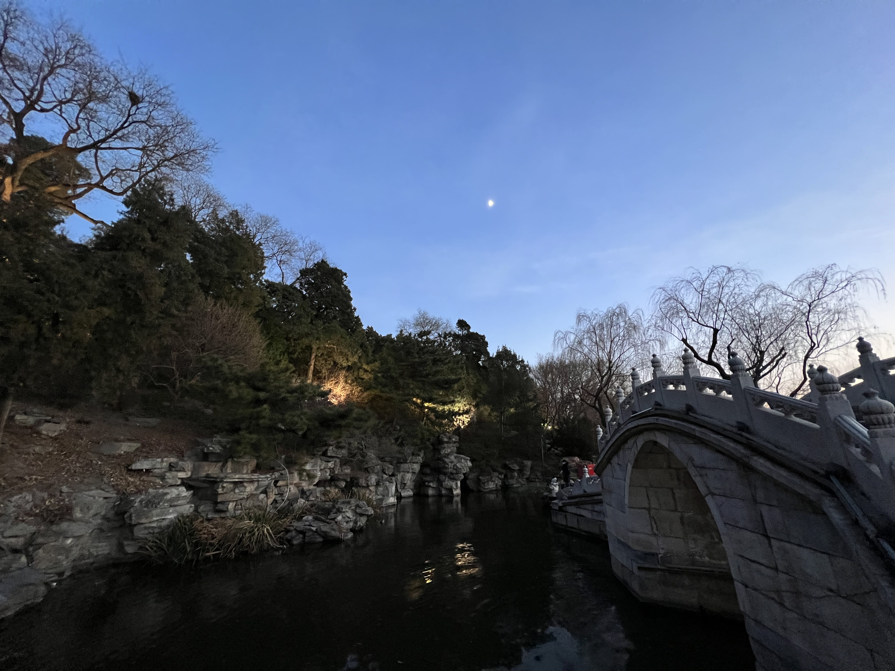
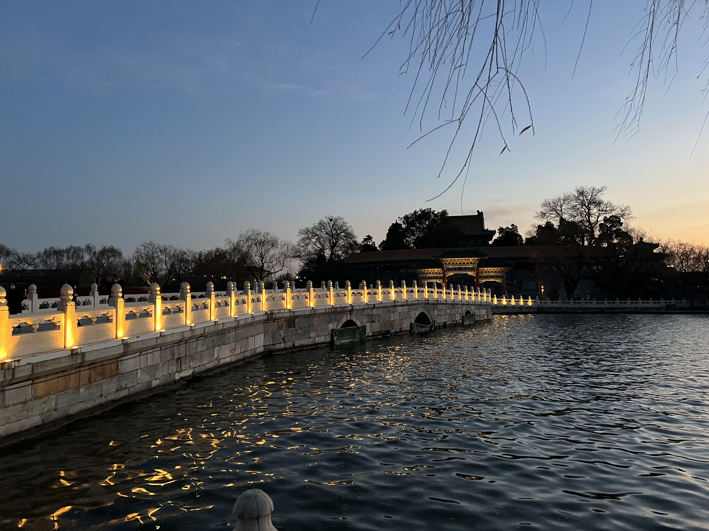
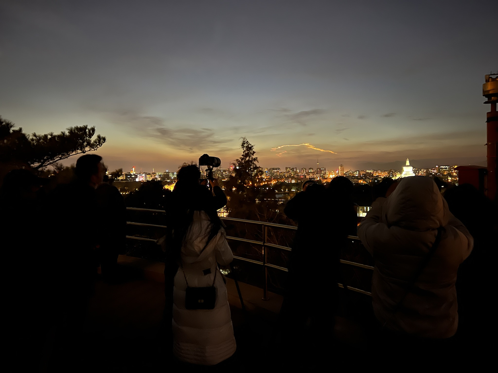
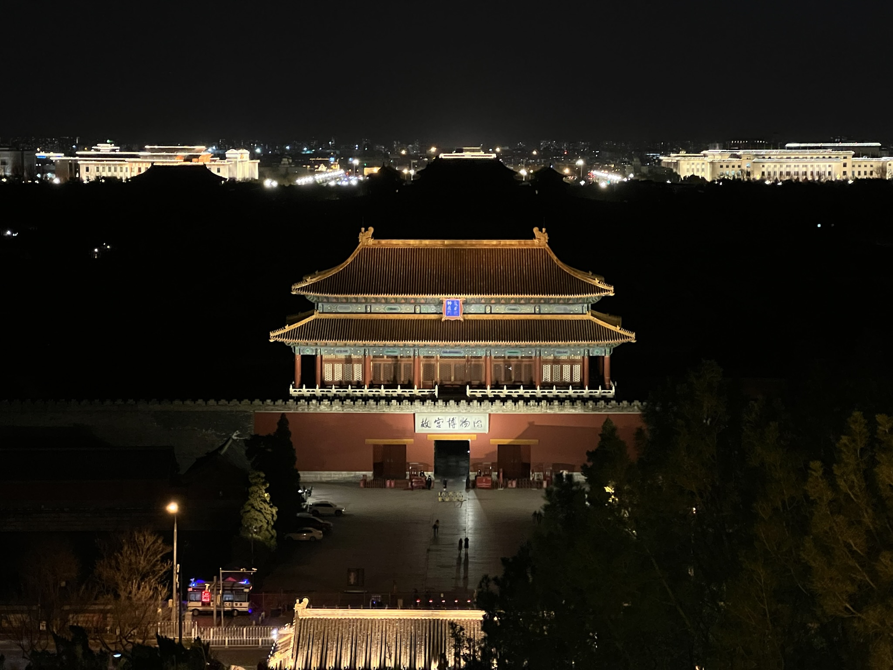

现在已经是 13 号了，时间过得真快，来不及展望，今年就要过完了。

今天终于截止了数据库和安卓的大作业，虽然有遇到一些不愉快，终于都结束了。

这是第 15 周，从上周开始已经基本没什么课了，后续就是一大堆考试，这应该是我考试最多的一个学期了吧。

昨天临时起意去景山公园，4 点出发，天气好，一路在赶着希望能见一面夕阳，路过北海，被余晖吸引，就下了车，先冲到北海公园，逛公园真是惬意。

随后也没丢了景山，虽然抵达时已经天黑得连路都看不清，最后也抵达了万春亭，俯瞰了一眼故宫。

