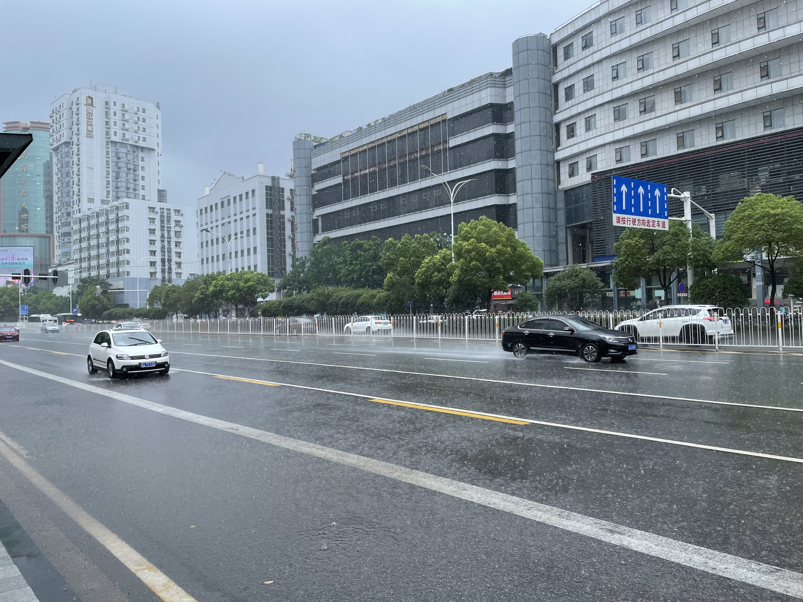

这个假期因为定好了要去支教，所以早在 6.27 就放假从呼市中转回阿拉善了，也没有选第三学期火热的 python 课，7.8 又赶往呼市考托福，和老同学们见了一面，7.14 又坐高铁赴北京，待了一晚上，7.15 坐飞机赴武汉。短短几天易地多次，引得别人好奇。

## Day1

这也是第一次来大兴机场，北京去西北的航班总在首都机场。

一个比较有趣的事情是，飞机刚刚落地武汉，就接到了表妹录取武汉的华中农业大学的消息，因为内蒙都是实时填报，之前聊天也没有提及过武汉的学校，因此感觉很是巧合。

一下飞机闷热袭来，这个英雄的城市确实很热。

天河机场从出站走到地铁站可谓是定向越野。坐 2 号线进市区，可以直接用支付宝。

到武汉好像也是我第一次喝茶百道，很喜欢茉莉奶绿。

江汉路步行街，很喜欢这条街。

大名鼎鼎的茶颜悦色排队的人确实多，不愿排队就喝不到了。

江汉关

在码头体验一下渡江的船。

两岸夜景甚好。

武汉的人真的很多。

听说黄鹤楼没必要进去，就远远看了看。

长江大桥

## Day2

一大早爬上公交车，决定再来个长江大桥过江。

桥上视角，桥上很多人不知道在看什么

观光武大，见司机和猴哥

看看人家的宿舍

东湖，心旷神怡

司机和猴哥有心招待我请我吃饭，可昨天酒店空调可能没调好，今天不幸感冒了，下午也实在是转不动，楚河汉街溜达了会，送我回西边儿，找了个商场吃了饭就散了

回酒店没事干，电视上看甄嬛传看了一晚上，决定养精蓄锐明天最后一天再多转转。

## Day3

兴致勃勃出来就被淋成落汤鸡了，又在上公交的时候被把伞夹断了，气死我了这个武汉的公交司机。

等雨停了，美术馆出来去坐公交，又错过了，于是去光谷看看，吃个午饭

顺着这条小路准备去山里看看。

这两天看看武汉这两所大学，就感觉自己上的大学是真没什么意思。

来到山里的书店看看，歇歇脚充会儿电。

临走，我的共享单车被骑走了，于是乎守株待兔等到下一个人停下之后骑上车跑之。

于是到了今天的高光时刻，我从书店山坡一路骑车而下，骑行东湖，清风袭来，今天遇到的一切不顺都烟消云散，雨后的湖边凉爽，静得连钓鱼的人都成了一幅画，顿时感觉与自然融为一体，真正意义上的心旷神怡，此情此景只有我一人享之，激动的我连连发微博感慨。

骑行近两小时，离开。

边等公交边听支教的会议，带队队长已到达小学，视频告知我们情况，看到宿舍的情况不免心寒，既然出来支教也只得接受明天开始可能日子不好过。

晚上又匆匆看了昙华林，黎黄陂路，最后在江边走走。

## Day4

早上最后来美术馆看看，可惜全是抗疫相关的作品，甚是无趣，后前往火车站与小伙伴见面前往恩施了。

## 碎片

在火车上又整理了一下这几天的碎片，发了个朋友圈。

