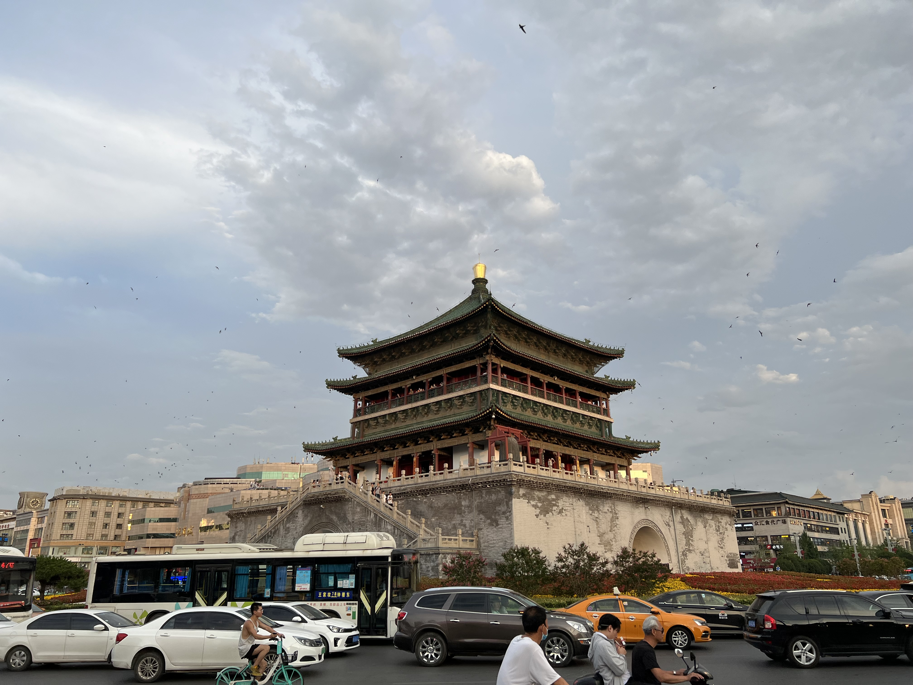
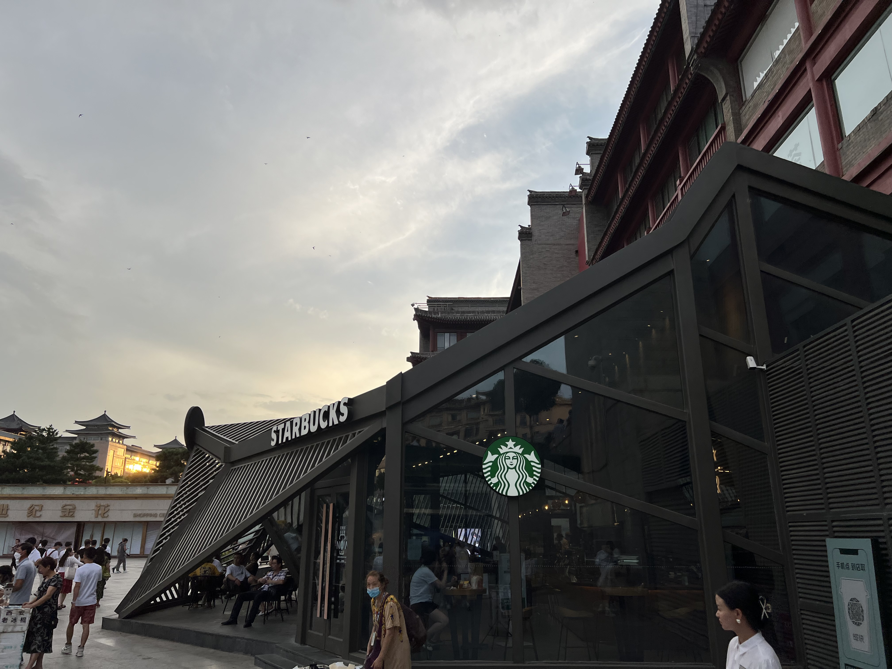

## DAY 1

话说阿拉善到西安机票只要 70 元，不过这个飞机是真不行

机场确实远，直奔钟楼

### 钟楼

### 回民街

豆豆西安分豆

晚上吃了附近评价比较好的羊肉泡馍和烤肉，感觉一般。

## DAY 2

直奔兵马俑

### 秦始皇陵

没有预期的那么震撼，不过还是震撼了几秒。

这个一号坑感觉保护得不大行。

据说因为水银含量高，依照现有技术来看，有生之年是见不到秦始皇本人的墓了，这么说来，还让人挺遗憾的。

不说景点本身，鱼龙混杂的导游，不健全的基础设施，临潼政府这边还有太多的空间可以改进。

不带要看华清宫了，缆车鸟瞰了下

可惜这个骊山塌方了，上来只让待在观景台看一眼就下去了

瘦弱的杨贵妃

回去了，极累。

话说在西安这两天，让我有一种在银川的感觉。

### 古城墙

没有吃到这家出名的肉夹馍，不过吃了旁边出名的油泼面

碗很大

三联

古城墙，下午天气不错

### 大唐不夜城

大唐不夜城是真的繁华和热闹啊，华灯初上，让我这两天对西安的印象焕然一新。

期待已久的“烂怂大雁塔”

很不巧，赶上疫情了。

## DAY 3

到处找地儿做核酸，贼难找，晒化了

白天的大唐不夜城

大唐芙蓉园

然后就溜了。
