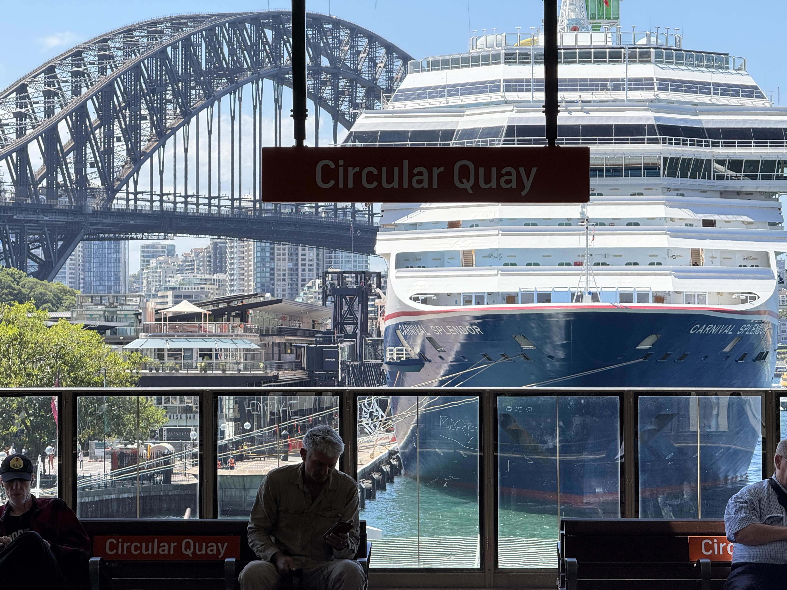
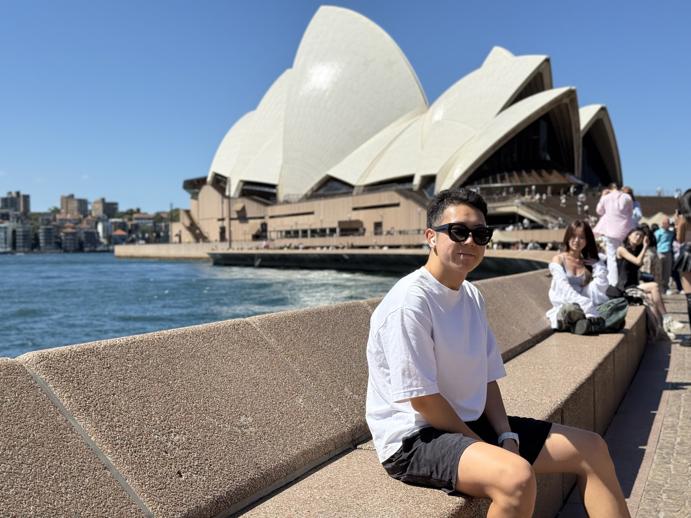
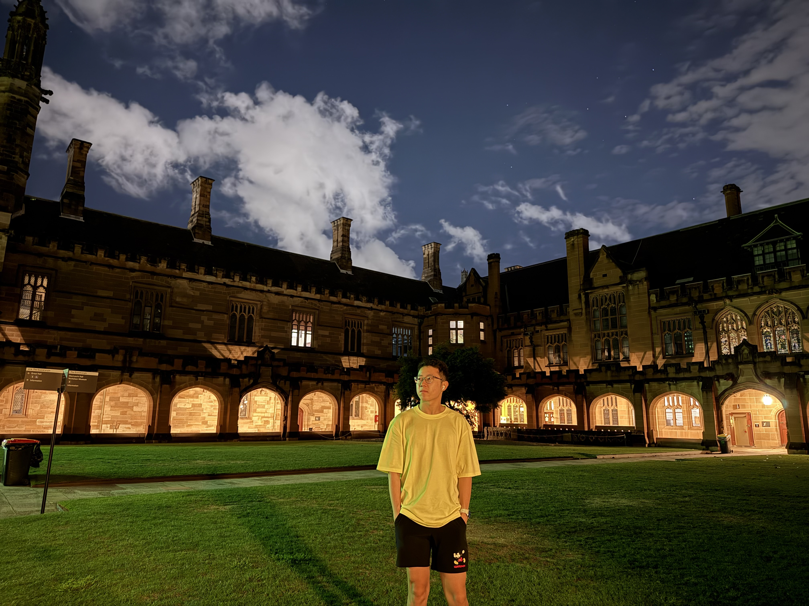
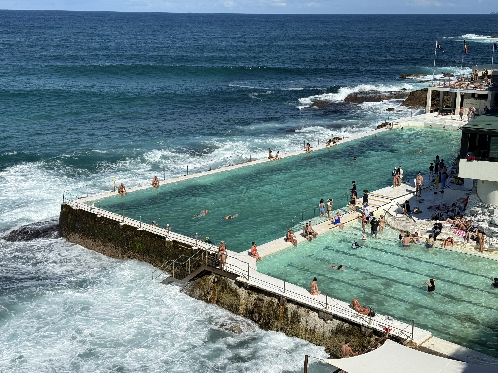
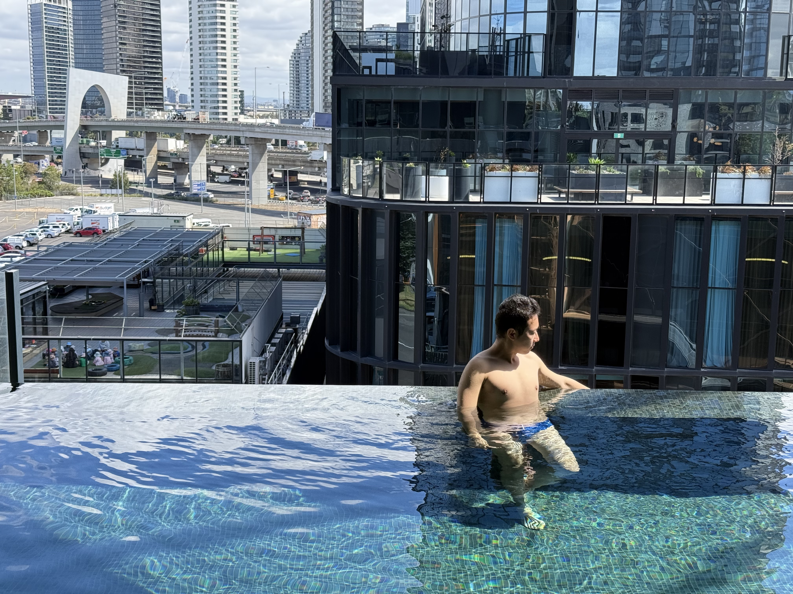
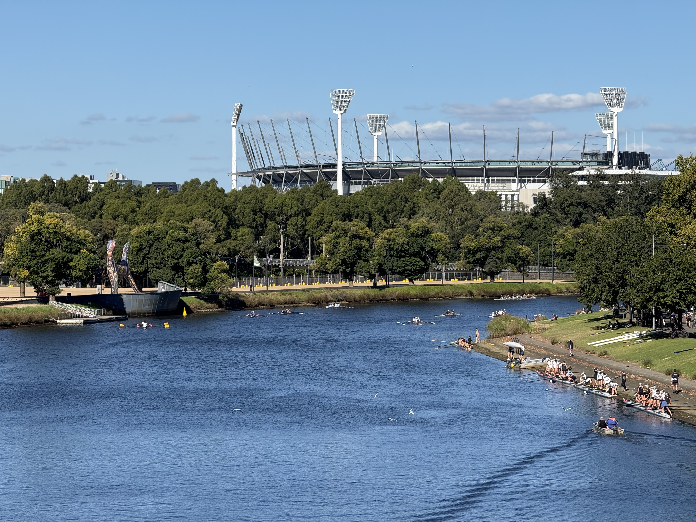
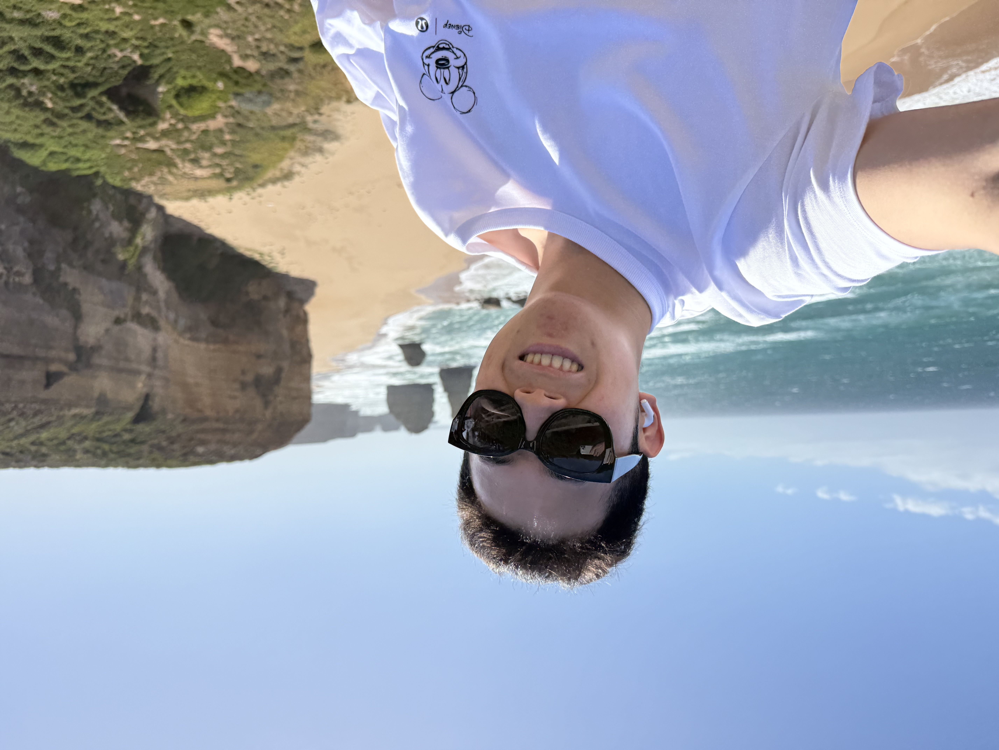

此行紧随美国之行之后，从洛杉矶直飞悉尼。LAX-SYD，DL41，15小时的飞行时长是我至今坐过最久的飞机，且不巧的是达美航空在太平洋没有覆盖Wi-Fi，好在旅途没有想象中那么辛苦，机型是A350-900，我坐在中间靠边的位置，我旁边座位刚好没有人，套了U型枕，加上前段旅程劳累，我一晚上几乎睡够了7h，其他时间看了书，看了电影，算是无痛抵达。

## 悉尼

到悉尼当然是先到歌剧院附近看看，也打卡了老早就刷到的这个站台，碰巧这天有一艘油轮停在这里。悉尼算是一个没有意外的城市，阳光的海滨旅游城市，和期待中一样。唯一一个比较意外的点是这个轨道交通运行起来没有什么噪音，反之在美国基本都是巨大的噪音。

从码头出发的轮渡，分别在白天和晚上坐了两个来回，白天吹着风很舒服，会经过歌剧院和大桥，有很多不一样视角。

晚上突然想到去看看悉尼大学，没想到一个人都没有，校门口可以看出这两天正在迎新，留着很多临时帐篷。

### 本地人的生活

这次在悉尼分别住了Mascot和Macquaire附近。Mascot给人的感觉是一个偏华人社区，各种中国食物，类似国内的小区，给人一种身在国内的感觉。Macquaire这个地方是坐着M1过去的，这个新地铁的设计和质量都非常好评，在这个区域的商场吃了两天饭，感觉有点像新加坡，同样是中国食物非常多，甚至口味比新加坡更像是在国内。

### 邦迪海滩

这里也是之前多次在网上刷到视频的地方，惬意的澳洲人在草坪上晒太阳，贴着海浪的泳池，小狗在礁石上尽情撒欢，一切都让人放松。这几天的天气刚好也是在20度上下，舒服得让人想在这里待上一天。

因为在悉尼待了很多天，还去很多比较小众地方，比如Watson’s Bay和La Perouse，都是非常好的海边去处。

## 墨尔本

从悉尼到墨尔本坐了Qantas，提供的苏打饼干不能更诠释什么是白人餐。

到墨尔本这天刚好赶上有一个希腊节庆典，市民都在唐人街附近庆祝，有节目，小吃，非常热闹。

被美国大车店摧残之后，这次在澳大利亚也是住到了正常硬件水平的酒店，问酒店前台是否需要额外电卡，告诉我：No, We are morden hotel.

学生在练习划船，天气很好。

墨尔本的海

### 大洋路

也算是重头戏，今年2025正是山河故人中“未来”所在的年份，可惜如今手机依然不是全息的，到了澳大利亚，肯定是安排一下张道乐参观的十二门徒，这也是经典road trip路线，没有车只好报了一个一日游，好在行程安排不错，总体体验感很好。

耳机放上Go West就从墨尔本一路向西了。

澳大利亚真的是一个非常非常宜居的地方，一年四季气候好，野外也没有危险物种，本地人的生活也很惬意闲适。
