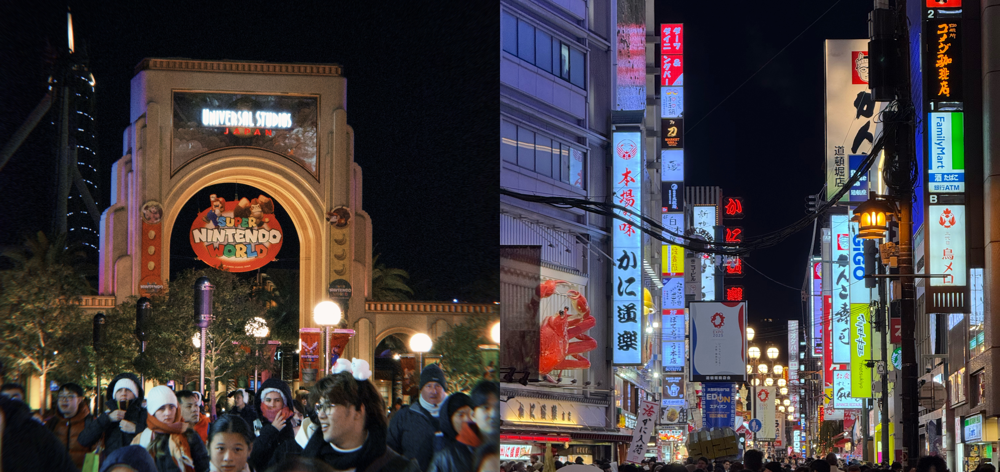
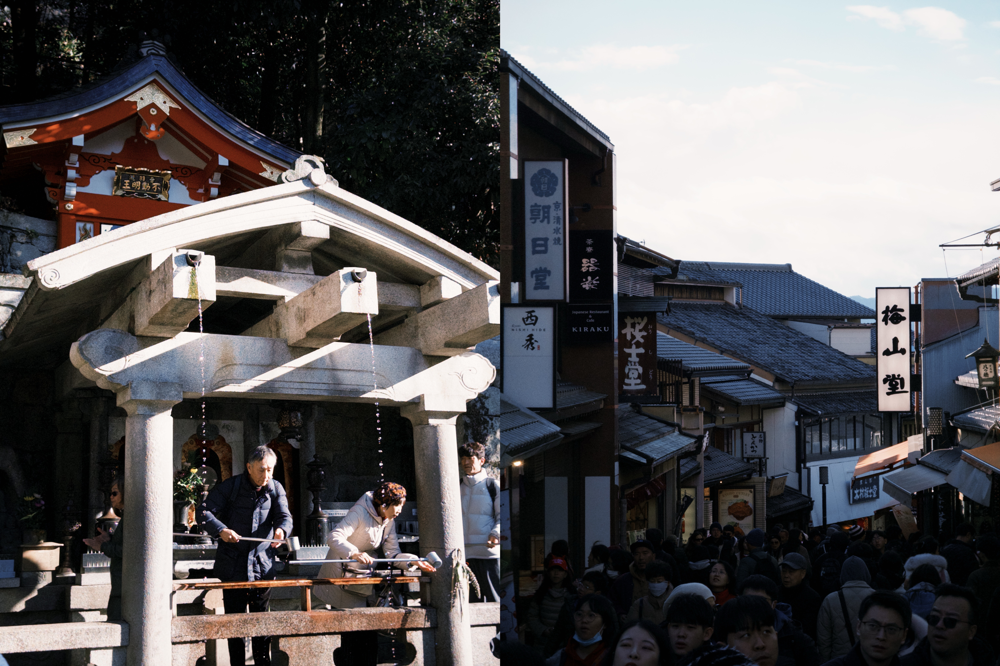
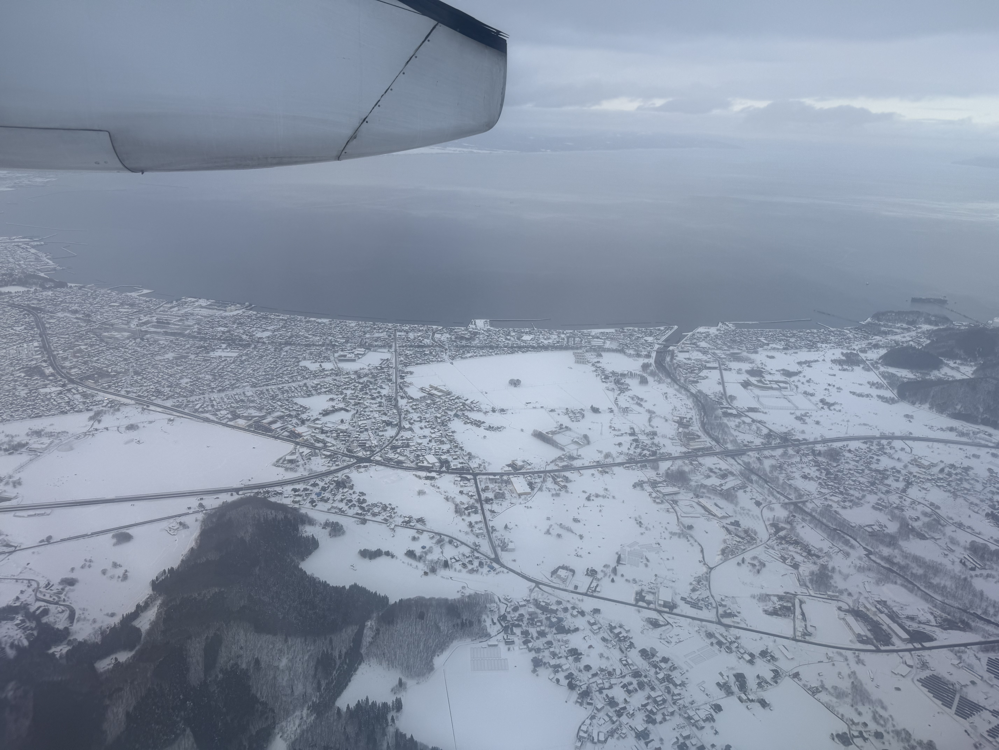
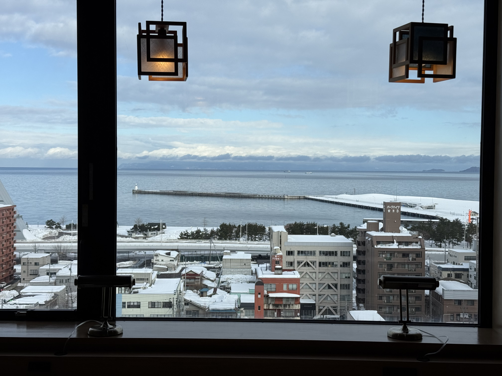
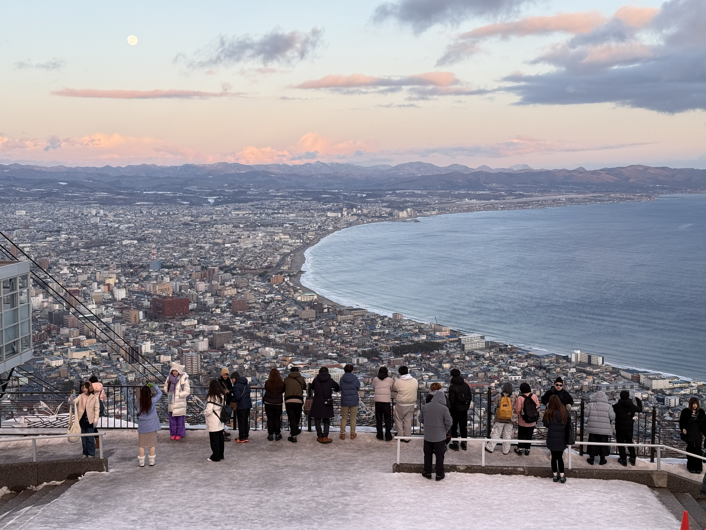
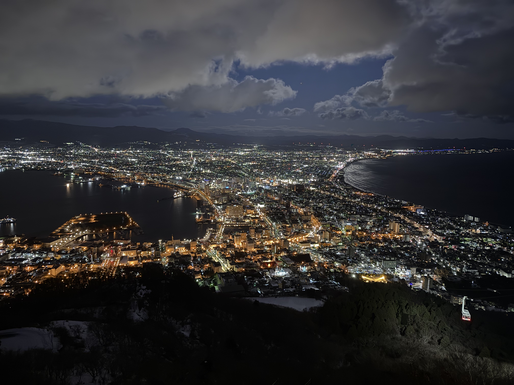
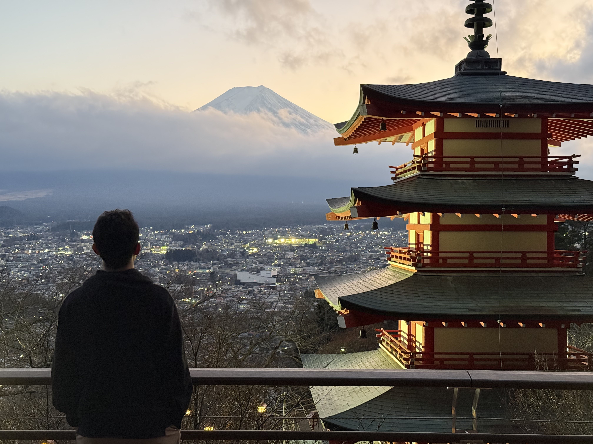
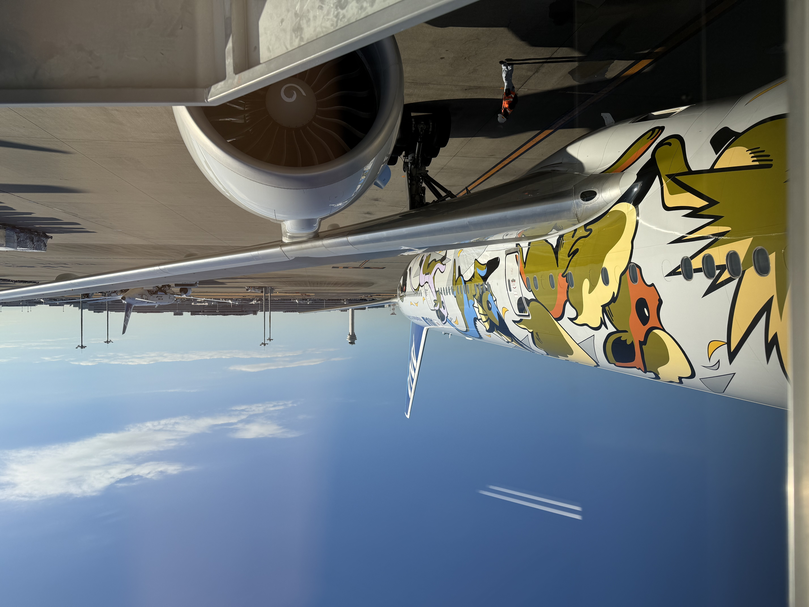
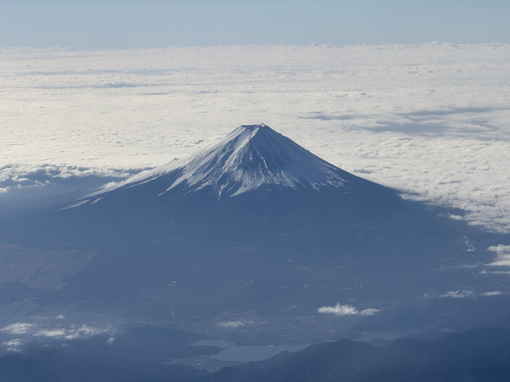

这次日本的行程主要计划去北海道，因为之前没有去过日本，所以顺带想逛逛大阪和东京，于是买了ANA的4段飞机：

>上海-大阪-青森
>
>札幌-东京-北京

实际上观光的城市有：大阪、京都、横滨、东京、青森、函馆、札幌

借着星盟金卡体验大阪和东京的休息室，对ANA也是非常满意，体验仅此新航。第一程飞机因为延误，最终赔偿了700人民币左右，对ANA好感倍增。

另外这次基本全程都在住Marriott一个叫4p flex的系列，一张小床，布局非常紧凑，但是五脏俱全，非常适合一个人住，建议全球推广。

### 大阪

到大阪第二天就又去了环球影城，马里奥园区值得一逛，其他到没有什么比较特别的地方。晚上吃了一家和牛烧肉放题，得知老板和店员都是越南人，刚好手头有上一段行程在越南留的现金，和老板沟通后用越南盾支付，且我剩下的这些钱刚好和价格几乎一致，也是非常巧合，也用上了在越南学的“谢谢”。心斋桥，道顿堀这附近的商业街几乎看不到尽头，这一点让我非常吃惊。

### 京都

从大阪到京都非常快，在驾驶室后面也可以看一路的风景，京都的初印象是精致优雅的。

### 青森

从大阪到青森，坐的是螺旋桨飞机，即将降落时也是满眼白色。可谓到了雪国。青森作为世界第一积雪的城市，落地后机场附近比人高的积雪给人感官震撼。今天住了一个温泉酒店，晚上美美泡了温泉，日本人洗澡是不存在省水的，热的冷的，户外的，桑拿房，最后在好好用盆浇一下，出来吃一个冰棍，感觉焕然一新。

### 函馆

这一段选择了一个特殊的前往方式：轮渡。船上人很少，自由席基本上是很多个大通铺，我一个人占了一个，看了看海，又回去躺下睡了一觉，醒来时候窗外已经是深蓝色，感觉恍惚。

### 札幌

### 小樽

看了雪落沙滩，看了企鹅，到天狗山下意识到要赶不上飞机了，于是又匆匆离开。

### 横滨

逛了横滨是因为这里酒店比较便宜，到东京也比较方便。意外的是一个惊喜城市。

### 富士山

抽了一天从新宿坐富士洄游前往河口湖，租了一个电助力车绕河口湖一周，拨云见山，又在下吉田看了日落，惬意极了。

### 东京

涩谷，银座。高度发达的城市。

ANA东京飞往北京的皮卡丘装涂，飞机上清晰可见的富士山，也是日本给我的最后一个惊喜，下次一定还来！

