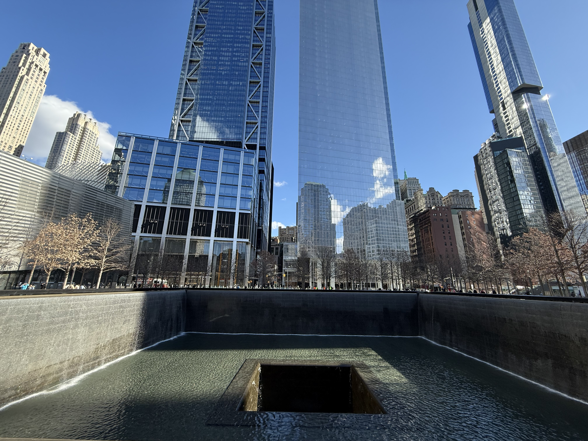
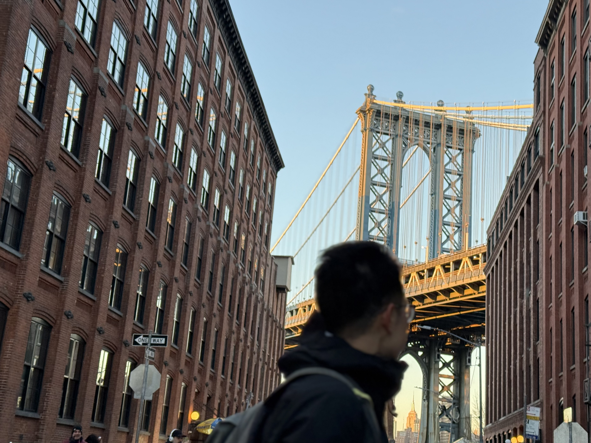
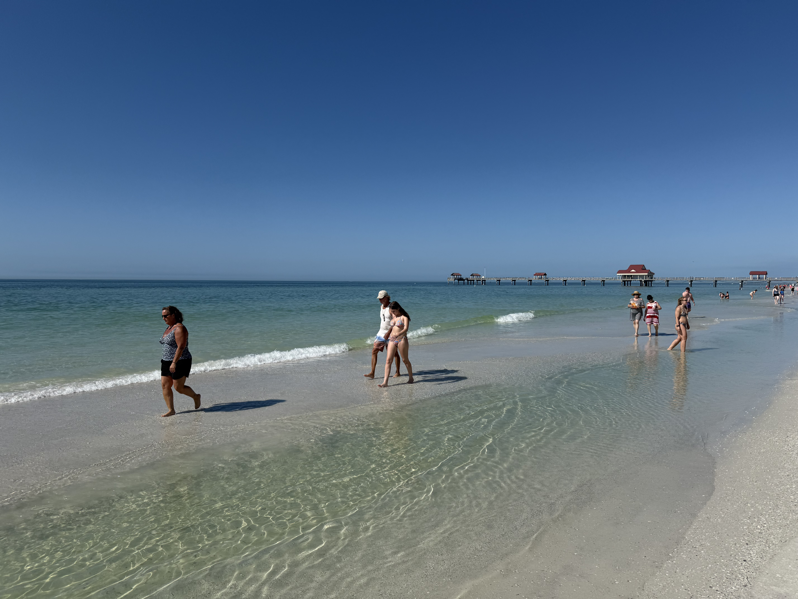
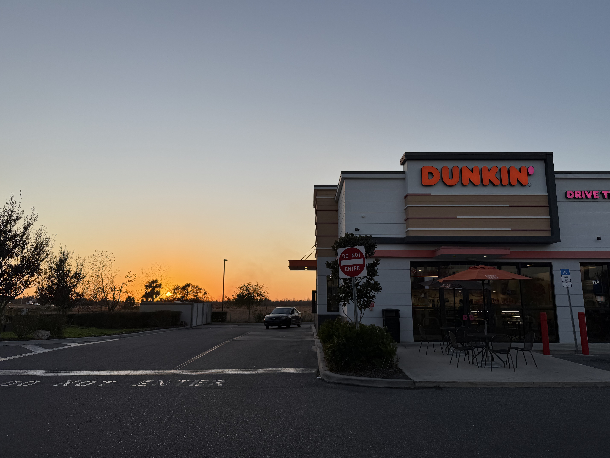
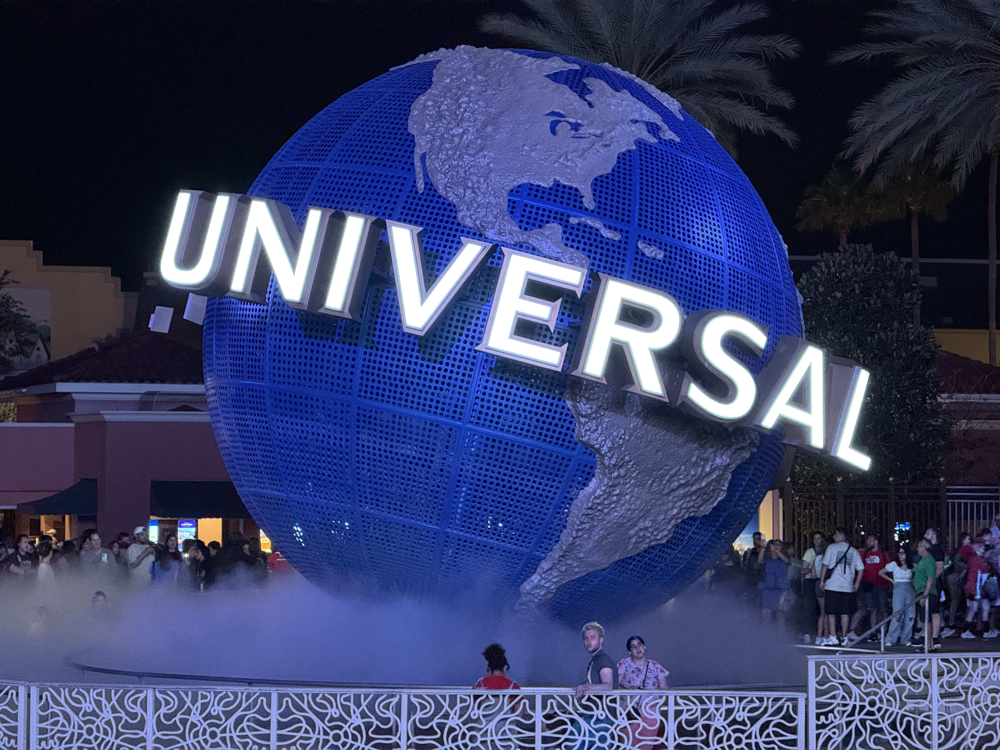
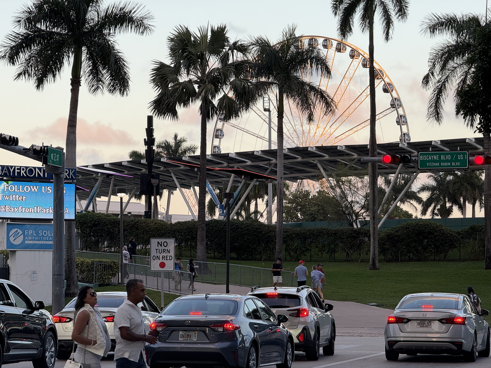
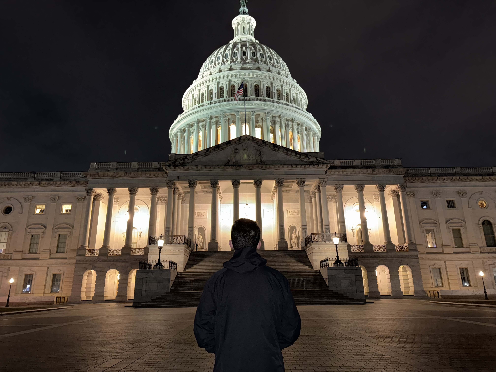
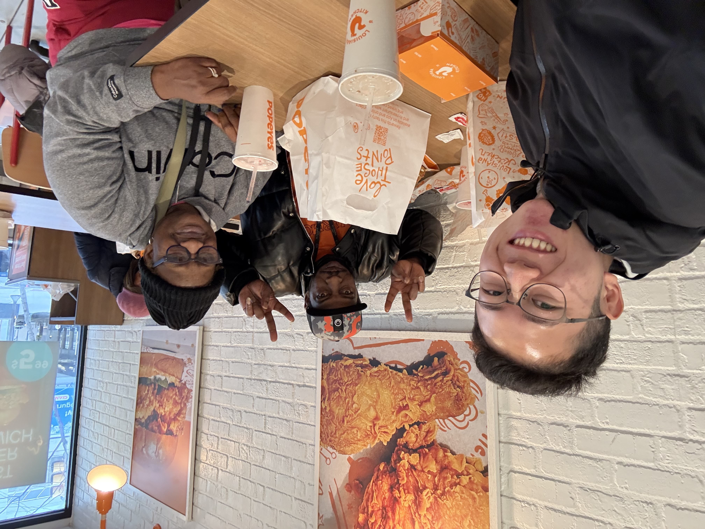
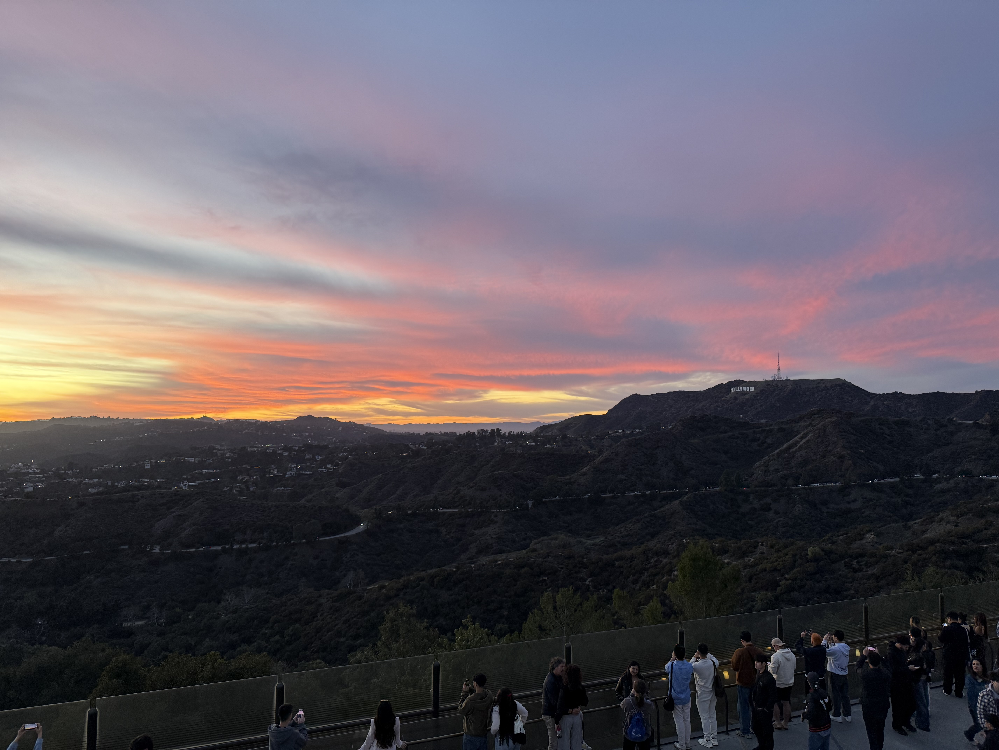

这次美国行去了西雅图、纽约、费城、波士顿、华盛顿DC、奥兰多、坦帕、迈阿密、洛杉矶。

虽然说对美国期待已久，想了几年，但是实际上这次旅行还是压力很大，因为这次行程之前已经旅行了太久，非常疲惫，最后一站是便利程度极高的日本，担心到美国还是会有一定的落差，加之行前家中出了一些变故，总体这次旅行还是偏被动：机票已买好，且工作之前不会再有这种大段时间，不得不走，所以2月1日还是拖着感冒+头疼的身体前往浦东机场，旅行没有太多计划，只是计划好了要去的城市，具体的路线到了再灵活决定。

大的路线是：

> 上海-西雅图-纽约
>
> 纽约—洛杉矶-悉尼

在纽约要停很久，所以中间计划要去美东其他的主要城市，最后再回纽约。

### 西雅图

2.1下午从浦东出发，实际上飞了一夜，达美航空这条航线意外的配有中文空乘，且红烧肉还不错。抵达西雅图过海关时候刚好是美西下午。第一印象和想象中还是没什么差的，比较现代化的机场，各色人种，清冷的空气，街上的流浪汉。

西雅图天气不错，海边风很大，在一个摩天轮旁边和西雅图建筑群与美国国旗合了个影。

总体来说城市里的现代化程度还比较高，在这样的天气下玻璃大楼映着天色逐渐深蓝。

晚上溜到华盛顿大学周边，学生们在寒冷的天气里穿着比较少的衣服从宿舍去体育馆健身，从外面就能看出大学的健身氛围很好，学生都在运动。晚上在uni village吃了shake shack，听身边的华人聊天，设想着大洋彼岸众多华人的另一种生活。

第一个比较意外的事情是酒店里没有拖鞋牙刷，也没想到今天住的AC Hotel竟在后续行程已经算好的了，在万豪大本营的美国，没想到酒店行业是如此发展。

### 纽约

从机场离开的air train价格堪比抢钱，显得市内地铁一次3刀都不算贵。

时代广场和想象中并不一样，直到走到最中心的位置才搞明白这就是时代广场，想办法拍了几张看起来灯红酒绿的照片。

城市的低密度高楼林立还是比较有压迫感的，但也不失公共图书馆这样内外都气势磅礴的大建筑。

期间还临时去逛了一下联合国，现场办理了一个名牌进去，没有预约讲解时则没什么可看的。

The Met与以往参观的博物馆有很大的不同。展品跨度比较大，从古埃及、古希腊罗马到文艺复兴，再到近现代艺术，博物馆内部的建筑风格也比较多样。

登上洛克菲勒中心观景台才是真正有了在纽约实感，一直从天亮看到天黑，感慨这座百年前就已经这样的，无数次出现在影视作品中的繁华的都市。

自由女神像🗽是坐着免费的往返轮渡看的，远看没有想象中那么震撼，看完从码头到华尔街，世贸中心，看着911遗址还是比较感慨的，如今只剩两个硕大的水池，悼念。

离开纽约前最后在布鲁克林度过了傍晚时分，好像是从钢筋水泥的曼哈顿跨到了另一个世界。

### 坦帕

感谢勇哥接机带我吃喝玩乐三天。从纽约飞到奥兰多，直接跨到了夏天。大车店，牛排，高架，从这开始才到了美国的另一种模式，大城市->大农村，这里不开车是真不行。

第二天吃完白人早饭，开始road trip，一路向西开到tampa的clear water，一路都很平，从城市高速到农村，再到沿海公路。

在海边坐着打发时间，超市逛一逛，度过这一天。晚上回程开到加油站，买了一大杯可乐，一个很大的美国国旗衬着日落，非常自由。

### 奥兰多

专门一天去了环球影城，此去环球影城主要是给n年前第一次知道环球影城时候对奥兰多这个大大的UNIVERSAL地球留下的执念一个交代，当时想着一定要来佛罗里达的环球玩，一定要去看海，如今都实现了也觉得恍惚，见到大地球的时候好像还没有当时晚上到北京环球时候看到那么激动。

### 迈阿密

其实这一段行程本来是没有的，结果遇到飞机延误耽误了一天在这里，于是就到市区逛了一圈，还挺惊喜的。永远对这种棕榈树，海滩，落日没有抵抗力。

### 华盛顿DC

这里和北京别无二致，超长的中轴线，超宽的路，空旷的广场，两侧的国家机关。作为首都比其他城市还是干净了很多，基本上是此行最干净人少的一个城市。

### 波士顿

从DC飞到波士顿这一路坐的是jet blue，这家航空公司明显比其他廉航好得多，起码有免费的饮料零食，空乘是个身材比较臃肿的中年白男，人很好，这一路都是低空飞行，加之天气很好，于是顺利的从DC、费城、纽约，一路看夜景到波士顿。看到了纽约上空的景象，依然很震撼。

波士顿非常非常冷，冷到我没什么心思在外面逛，沿着自由之路走了没一半就走不下去了，印象比较深刻的是图书馆，里外都非常漂亮。

第二天逛了哈佛和MIT，感叹寒冷的地方确实适合做学术。

### 费城

先到宾夕法尼亚大学转了一圈，校园氛围非常好，去看了林徽英故居的书店，还在沃顿商学院遇到一个男生给另一个男生表白，引得周围路过的学生惊呼送上祝福。

费城黑人很多，吃炸鸡遇到两个友善的朋友告诉我要小心，这里的人都疯了。

### 洛杉矶

此次旅行最期待的LA，主要也是因为lalaland和lana del rey。加州的阳光总是给人最自由的感觉。

去了venice beach，santa monica，圣地巡礼打雷的画像，坐再星巴克门口听着VB看路人悠闲经过。

UCLA也是曾经的梦校，大一时候还幻想着能到这里上学。学校里面的体育氛围很好，学生都很阳光。谁来了都得羡慕吧。

在比弗利山庄大概就是大家理想中美国人生活的具像化，别墅一栋接着一栋，房子设计得各有特色，一家都有好几辆车。

晚上到格里菲斯天文台，赶上一场盛大的日落，远眺Hollywood Sign，耳机里放上原声带，看了那么多遍的lalaland终于也是呈现在眼前。

看过洛杉矶的夜景，乘车下山前往机场赶飞往悉尼的飞机，虽然最终因为10043没能到这里读书，但这次美国之行也是画上了圆满的句号，给了五年前的自己一个交代。